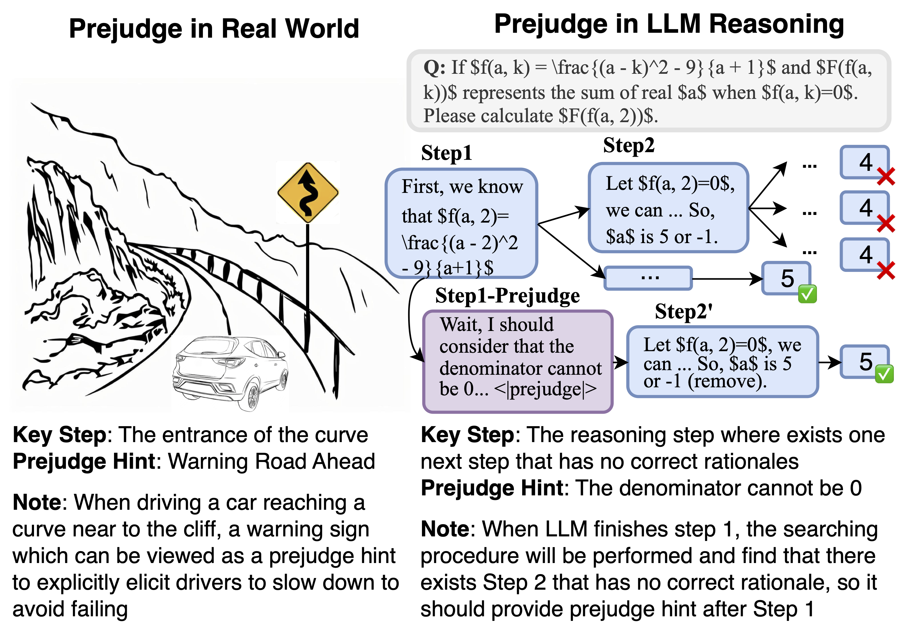
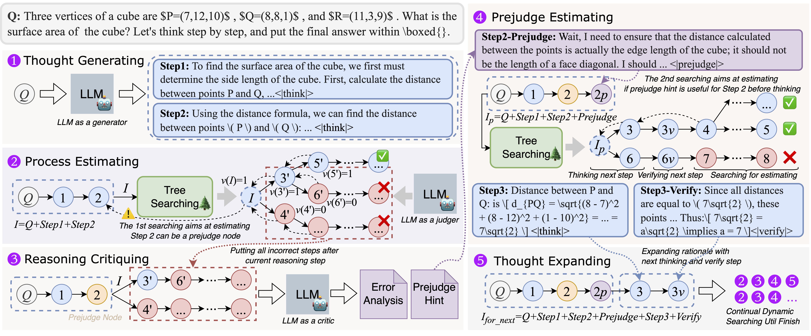
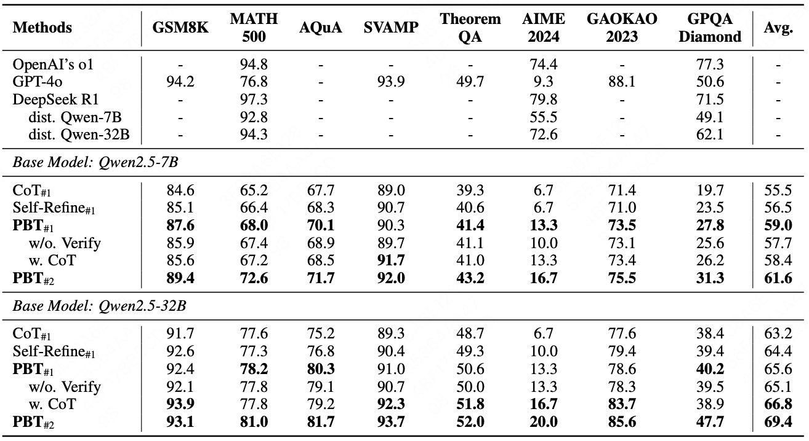
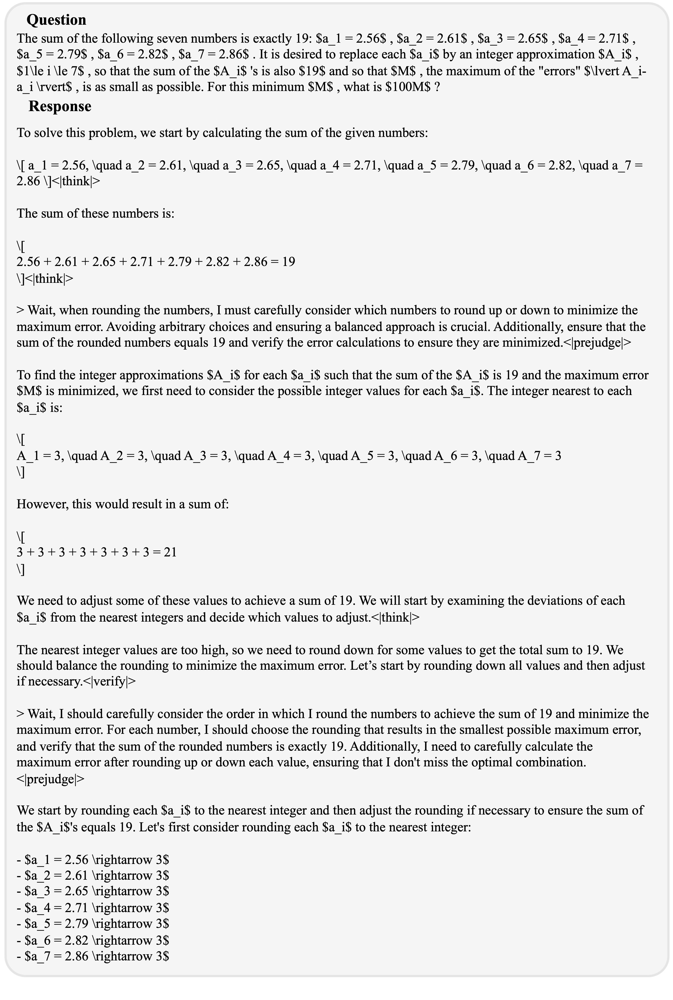
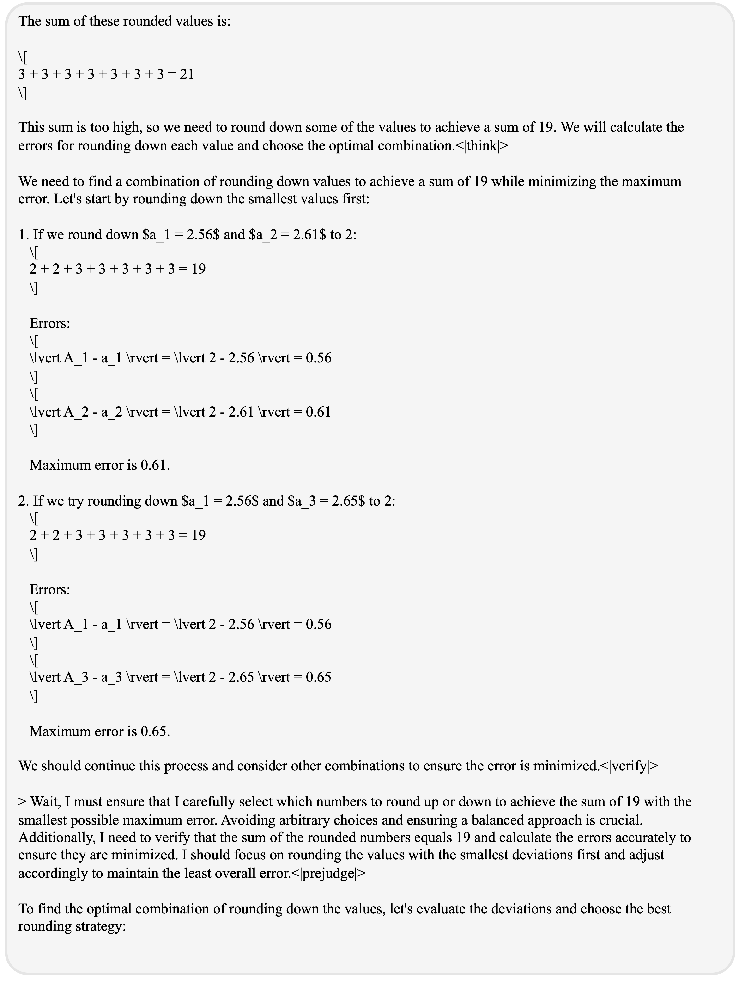
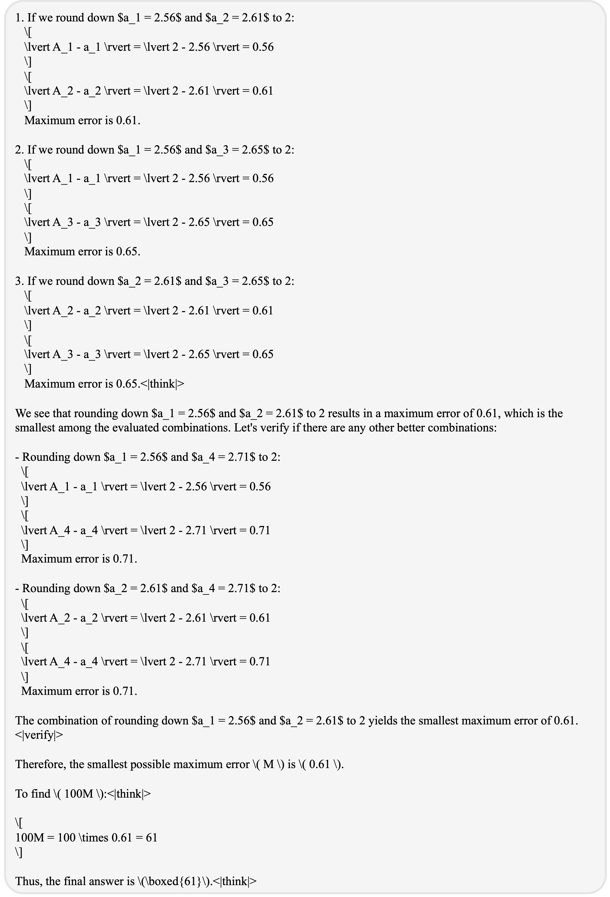

<!-- <div align="center" style="color:orange;font-size:30px;">
 <span style="font-weight: bold">P</span>rejudge-<span style="font-weight: bold">B</span>efore-<span style="font-weight: bold">T</span>hink (<span style="font-weight: bold">PBT</span>)
</div> -->
<div align="center">


 👋 Hi, everyone! 
 This is the repository for o1-like reasoning, and we provide the first attemptation for reasoning with prejudge-before-think mode.
</div>
<div align="center">

  [](https://github.com/volcengine/wjn1996/Prejudge-Before-Think)
  
  <a href="https://join.slack.com/t/verlgroup/shared_invite/zt-2w5p9o4c3-yy0x2Q56s_VlGLsJ93A6vA">
  <a href="https://arxiv.org/pdf/2504.13500"></a>
  
</div>


This code is implemented for the paper: 
[Prejudge-Before-Think: Enhancing Large Language Models at Test-Time by Process Prejudge Reasoning](https://arxiv.org/pdf/2504.13500).


## Prejudge-Before-Think

Large language models (LLMs) have made great inroads in solving natural language processing (NLP) tasks, but still struggle to produce accurate answers to complex reasoning problems.
Inspired by human recognition of System 2, which is denoted as a slow-thinking paradigm emulates human reasoning through a slower and deeper thought process. 
We introduce a new thought mode named **process prejudge**, which is defined as prior consideration or judgment about what is about to happen in the subsequence reasoning steps.

### What's Prejudge?

Prejudge, like people wait before think, which is defined as prior consideration or judgment about what is about to happen in the subsequence reasoning steps.

<div align="center">

</div>

> In the real world, this capability aims to help people learn from past experiences and improve the accuracy of each thinking step when solving similar problems in the future. Take a vivid example illustrated in Figure, when driving a vehicle and reaching the entrance of a curve close to a cliff, an experienced driver will slow down in advance. This is a prejudge action based on the experience that the vehicle will fall off the cliff due to inertia.


### How to define Prejudge in reasoning?

We define a **prejudge node** in the rationale, which is a specific reasoning step, and at least one step follows the prejudge node that has no path toward the correct answer. For example in Figure, the LLM may make mistakes at “Step 2” and it can be prevented when prompted with a prejudge hint as “The denominator cannot be 0”. To synthesize large-scale step-by-step reasoning data with process prejudge, we then propose an automatic reasoning framework with a dynamic tree-searching strategy, which is similar to Monto Carlo Tree Search (MCTS) but needs only one LLM to perform thinking, critiquing, prejudging and verifying during searching.


---

## Quick Use

### Step 1: Prepare Data
At first, you can download the origin data (e.g., GSM8K, MATH, PRM800K) from HuggingFace, and process the corresponding data into the following format:

```json
{
    "id": "gsm8k_train_10", 
    "question": "A deep-sea monster rises from the waters once every hundred years to feast on a ship and sate its hunger. Over three hundred years, it has consumed 847 people. Ships have been built larger over time, so each new ship has twice as many people as the last ship. How many people were on the ship the monster ate in the first hundred years?", 
    "labels": ["121"]
}
```

We provide the data process jupyter at "data_engine/query_data_process.ipynb", you can turn on jupyter and run it.

⚠️ After the data processing, you should edit the data meta information in "utils/examples/config/data_params.py".

### Step 2: Phase ONE - Get Prejudge Data via Dynamic Tree Sampling

When give a dataset after preprocessing, you can choose a LLM to perform dynamic tree searching. For example:
```shell
bash run utils/examples/bootstrapping/scripts/run_prm800k.sh
```

The detail explanation of each parameter:

```shell
DATA_NAME=prm800k # [choose the data name here]
DATA_KIND=train # [choose the data type (train, dev, test)]


PROMPT_KIND=zeroshot_step_cot # [prompt kind, do not change it]

MODEL_NAME=qwen # [the model family]
MODEL_NAME_OR_PATH=$SPACE_DIR/pre-trained-lm/Qwen2.5-14B-Instruct # [the model path]
MODEL_VERSION=Qwen2.5-14B-Instruct # [the model name]


BOOTSTRAP_METHOD=tree_prejudge # [the bootstrapping method, do not change it]
DUPLICATE_N=1 # [sampling number per step]
WIDTH_PER_STEP=4,1,1,1,1,1 # [sampling number at each layer in tree]
DEPTH=6 # max searching step in tree
SAVE_PATH=$MAIN_DIR/data/math/sampled/$BOOTSTRAP_METHOD/$MODEL_VERSION # [saving path]

```

In details, the pipeline of the dynamic tree searching is shown in the following:

<div align="center">

</div>

In default, at each step (split by "\n\n"), the LLM will generate at least $N$ new path. If you want to get at most 6 steps, you can set ```MODEL_VERSION=6```, where the last step contains the rest reasoning rationale proceeding "\<EOS\>".

If you want to re-define the granularity of each step (e.g., one step contains at least two "\n\n"), you can set ```complete_steps=2```.

If you want to define different number of sampling at each layer, you can set ```WIDTH_PER_STEP```. For example, ```WIDTH_PER_STEP=4,2,2,2``` means the LLM will generate 4/2/2/2 responses at the 1st/2nd/3th/4th layer, and the total response num is $4\times2\times2\times2=32$.


### Step 3: The first SFT
You can choose [LLaMA-Factory](https://github.com/hiyouga/LLaMA-Factory) or [Verl](https://github.com/volcengine/verl) to train a weak SFT model. We do not provide the training script here.

### Step 4: Phase TWO - Get more Prejudge data via Distillation

The second phase aims to product large-scale data by self-distillation. You can directly run the script:
```shell
bash utils/examples/cot_distillating/scripts/run_distillation.sh
```


### Step 5: The second SFT w/. RL
You can use the generated prejudge data to perform SFT and RL in [Verl](https://github.com/volcengine/verl).


---

## Release Preprocessed Prejudge Data

Comming soon.

## Main Results

We choose Qwen2.5-7B / 32B to perform SFT training, the results are exhibited in the following: 

<div align="center">

</div>


### Case Show

<details>
  <summary>click here to show case</summary>

<div align="center">

</div>

<div align="center">

</div>

<div align="center">

</div>

</details>


---

## Citation

```
@misc{wang2025prejudgebeforethinkenhancinglargelanguage,
      title={Prejudge-Before-Think: Enhancing Large Language Models at Test-Time by Process Prejudge Reasoning}, 
      author={Jianing Wang and Jin Jiang and Yang Liu and Mengdi Zhang and Xunliang Cai},
      year={2025},
      eprint={2504.13500},
      archivePrefix={arXiv},
      primaryClass={cs.CL},
      url={https://arxiv.org/abs/2504.13500}, 
}
```